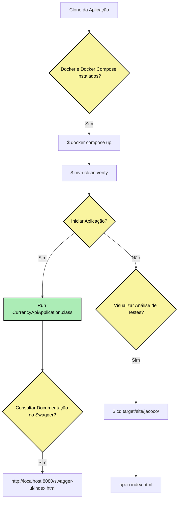

## Documentação Currency API 📕


[](https://docs.oracle.com/javase/17/docs/api/)


Projeto para o módulo de Testes Automatizados I do Santander Coders.

O projeto *Currency* é uma API desenvolvida para consumir a API [AwesomeAPI](https://docs.awesomeapi.com.br/)

## Testes e Cobertura ☕

O projeto inclui testes automatizados utilizando as seguintes tecnologias, ferramentas e bibliotecas:

<ul>
    <li>
        <a href="https://junit.org/junit5/">
            JUnit 5
        </a>
    </li>
    <li>
        <a href="https://site.mockito.org/">
            Mockito
        </a>
    </li>
    <li>
        <a href="https://www.jacoco.org/jacoco/trunk/doc/">
            JaCoCo
        </a>
    </li>
    <li>
        <a href="https://mvnrepository.com/artifact/org.assertj/assertj-core">
            Assertj-core
        </a>
    </li>

</ul>


## Configurando e inicializando o projeto ☕

<details>
  <summary>Fluxograma</summary>


</details>

Primeiramente deverá fazer o clone da aplicação em sua máquina:

* Através do https
```
    git clone https://github.com/elissatavares/currency-api.git
```

* Através do ssh
```
    git clone git@github.com:elissatavares/currency-api.git
```

Para essa próxima etapa é necessário ter o  `docker e docker compose` instalado e configurado.

Na pasta currency-api execute o comando a seguir para inicializar o banco de dados.

```
    docker compose up
```

Foi utilizado o `Maven` para instalar todas as dependências do projeto e a ferramenta [JaCoCo](https://www.jacoco.org/jacoco/trunk/doc/) garantir que o build seja bem-sucedido somente se o código atender aos limites de cobertura especificados para linhas, classes, métodos e branches (100% de cobertura). Para executar um build do projeto use o comando:


```
    mvn clean verify
```

E, por fim, vá até a classe  `CurrencyApiApplication` para iniciar o servidor no endereço: [http://localhost:8080](http://localhost:8080)

**📕 Para consultar a através do Swagger-ui vá para a [Documentação no Swagger](http://localhost:8080/swagger-ui/index.html).**

**📕 Para visualizar a análise detalhada dos testes, navegue até target/site/jacoco/ e abra o `index.html` no seu navegador.**


## Dependências ☕

<ul>
    <li>
        <a href="https://mvnrepository.com/artifact/org.springframework.boot/spring-boot-starter-data-jpa">
            spring-boot-starter-data-jpa
        </a>
    </li>
    <li>
        <a href="https://mvnrepository.com/artifact/org.springframework.boot/spring-boot-starter-validation">
           spring-boot-starter-validation
        </a>
    </li>
    <li>
        <a href="https://mvnrepository.com/artifact/org.projectlombok/lombok">
            lombok
        </a>
    </li>
    <li>
        <a href="https://mvnrepository.com/artifact/org.springframework.cloud/spring-cloud-starter-openfeign">
            spring-cloud-starter-openfeign
        </a>
    </li>
    <li>
        <a href="https://mvnrepository.com/artifact/org.assertj/assertj-core">
            assertj-core
        </a>
    </li>
    <li>
        <a href="https://mvnrepository.com/artifact/org.springframework.boot/spring-boot-starter-web">
           spring-boot-starter-web
        </a>
    </li>
    <li>
        <a href="https://mvnrepository.com/artifact/org.postgresql/postgresql">
           postgresql
        </a>
    </li>
    <li>
        <a href="https://docs.spring.io/spring-security/reference/servlet/test/index.html">
           spring-boot-starter-test
        </a>
    </li>
           <li>
        <a href="https://mvnrepository.com/artifact/org.springdoc/springdoc-openapi-starter-webmvc-ui">
           springdoc-openapi-starter-webmvc-ui
        </a>
    </li>
        </a>
    </li>
</ul>


## 🤝 Colaboradores
<a name="contribua"></a>
<table align="center"><tr>
</td>
    <td align="center"><a href="https://github.com/elissatavares" target="_blank">
    <br />
    <sub><b>Elissa Tavares</b></sub></a>

<br />
<a href="https://www.linkedin.com/in/elissatavares/" alt="LinkedIn">
  </a>
</td>
  </tr>
</table>


## 📝 Licença
Esse projeto está sob licença. Veja o arquivo [LICENÇA](https://github.com/elissatavares/ada-web-planner/blob/main/LICENSE.md) para mais detalhes.


<p align="center">Copyright © 2024 | Currency API </p>


